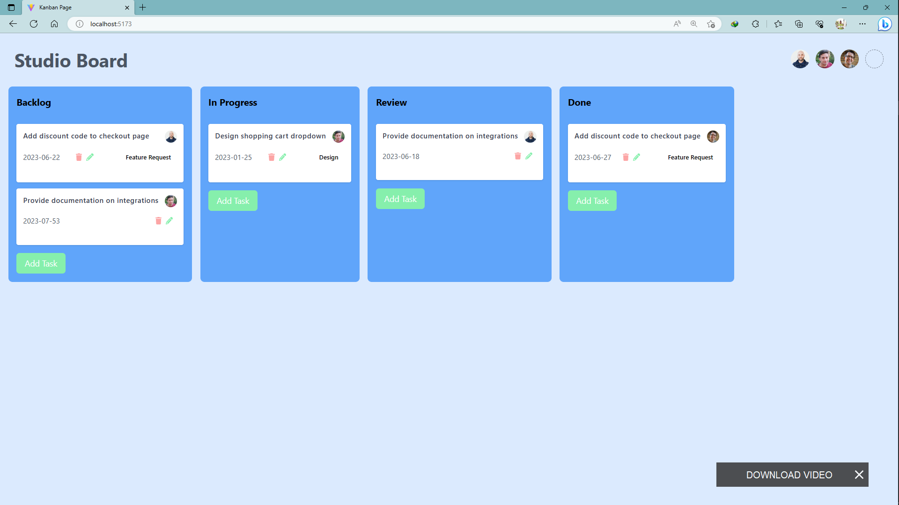

# Trello Clone

This is a simple Trello clone built with Vue 3 and Vite. It provides a basic Kanban board interface for managing tasks and allows you to create, edit, and delete tasks in different columns using drag and drop functionality.



## Demo

A live demo of the app can be found [here](https://example.com).

## Table of Contents

- [Features](#features)
- [Prerequisites](#prerequisites)
- [Installation](#installation)
- [Usage](#usage)
- [Contributing](#contributing)
- [License](#license)
- [Author](#author)

## Features

- Drag and drop functionality for task management.
- Add, edit, and delete tasks in different columns.
- Responsive design for optimal viewing on different devices.
- Simple and intuitive user interface.

## Prerequisites

Before running the app, ensure that you have the following dependencies installed on your machine:

- Node.js
- npm (Node package manager)

## Installation

1. Clone the repository:

```bash
git clone https://github.com/Zo-ambinintsoa/trello-vue.git
```

2. Navigate to the project directory:

``` shell
 cd trello-clone
  ```

3. Install the package:

``` shell
 npm install
  ```

## usage 

To start the development server, run the following command: 


``` shell
 npm run dev
  ```


This will start the development server and open the app in your default browser. You can access it at **http://localhost:5173**.

The app provides a Kanban board interface where you can create different columns and add tasks to each column. You can drag and drop tasks to move them between columns or reorder them within a column. Click on a task to edit its details, and use the delete button to remove a task.

Feel free to customize the app by modifying the code in the src directory.


## contributing
<p> Contributions are welcome! If you have any suggestions, bug fixes, or new features to propose, please follow the steps below: </p>

<style>
ul {
  list-style: none;
  padding-left: 0;
}

li {
  margin-bottom: 10px;
}

li::before {
  content: "";
  display: inline-block;
  width: 8px;
  height: 8px;
  border-radius: 50%;
  background-color: #007bff;
  margin-right: 10px;
}
.table {
  width: 100%;
  margin-bottom: 1rem;
  color: #212529;
  border-collapse: collapse;
}
.table th,
.table td {
  padding: 0.75rem;
  vertical-align: top;
  border-top: 1px solid #dee2e6;
}
.table thead th {
  vertical-align: bottom;
  border-bottom: 2px solid #dee2e6;
}
.table tbody + tbody {
  border-top: 2px solid #dee2e6;
}
.table-sm th,
.table-sm td {
  padding: 0.3rem;
}
.table-bordered {
  border: 1px solid #dee2e6;
}
.table-bordered th,
.table-bordered td {
  border: 1px solid #dee2e6;
}
.table-bordered thead th,
.table-bordered thead td {
  border-bottom-width: 2px;
}
.table-striped tbody tr:nth-of-type(odd) {
  background-color: rgba(0, 0, 0, 0.05);
}
</style>
<ul>
  <li>Fork the repository.</li>
  <li>Create a new branch for your feature or bug fix.</li>
  <li>Make your modifications.</li>
  <li>Commit your changes and push to your forked repository.</li>
  <li>Submit a pull request explaining your changes.</li>
</ul>


## Author


<table class="table table-bordered table-striped">
  <thead>
    <tr>
      <th>Name</th>
      <th>Profession</th>
      <th>LinkedIn Profile</th>
    </tr>
  </thead>
  <tbody>
    <tr>
      <td>Ambinintsoa Mananjara Herizo</td>
      <td>Full Stack Developer</td>
      <td>
        <a href="https://www.linkedin.com/in/zo-ambinintsoa/" target="_blank">LinkedIn Profile</a>
      </td>
    </tr>
  </tbody>
</table>